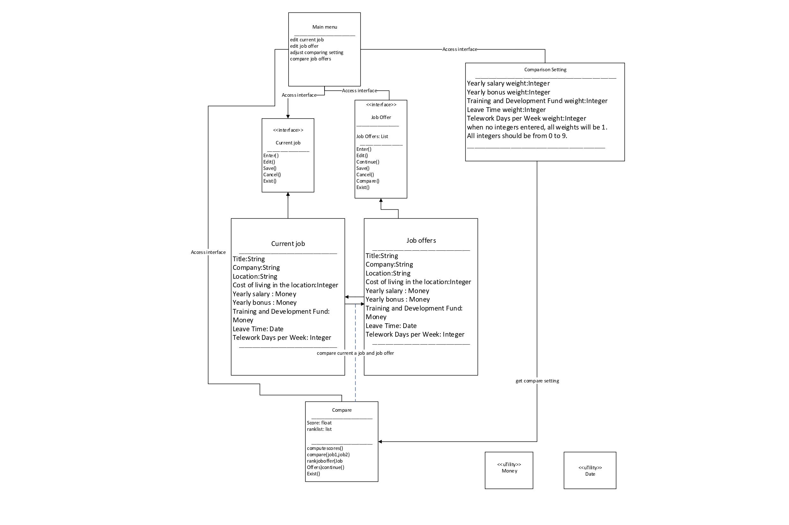

# Design Discussion

## Design 1

Pro:  Design is easy to implement, maintain and understand. Complex logic is taken out and simplified to made it a logical flow.    
Con: Do not need to show the purely GUI-specific class at this stage. Some defined relations between classes are wrong.

## Design 2

Pro:  Decoupling and Flexibility - Interfaces allow for the separation of implementation details from the code that uses the interface. This means that CurrentJob and JobOffers parts of a program can be developed, tested, and maintained independently.  
Con: Introducing interfaces can add an extra layer of abstraction, which might make the codebase more complex and harder to understand. Overhead of Implementation because every class that implements an interface must provide concrete implementations for all the methods declared in the interface, which can lead to boilerplate code and increased development time.  

## Design 3
  
Pro:  Relationship between each class is clearly labeled and all operations in the class is detaily shown in the graph. Every function of the software is fullfilled by the operation in the class.

Con:  Some types are missing. For instance, IsCurrentJob should be a Boolean. Some operations and relationships are repeated.

## Team Design
  
We keep App, MainMenu, JobRecord, ComparisonSetting and JobComparator these classes from Design 1 as they are simple and satisfied all our requirement. We made modifications that deleting a purely GUI-specific class since we don't need them as this design stage and change the relations of classes from aggregation to association. We discussed and further consulted with study material to find that *Aggregation is a specialized form of association that represents a whole-part relationship between the aggregate (whole) and its parts*. Since MainMenu and job classes does not have a whole-part relations, we change the relations to associaton. 

## Summary
In the process of discussion, we have a more thorough understanding of the project structure and the module we need. By comparing each design, we noticed the pros and cons in our consideration and made improvement to our team design. We gained a deeper understanding of concepts in Object-Oriented Design and the use of UML. We learned a lot from each of our members and made great collaboration in our team work. 

