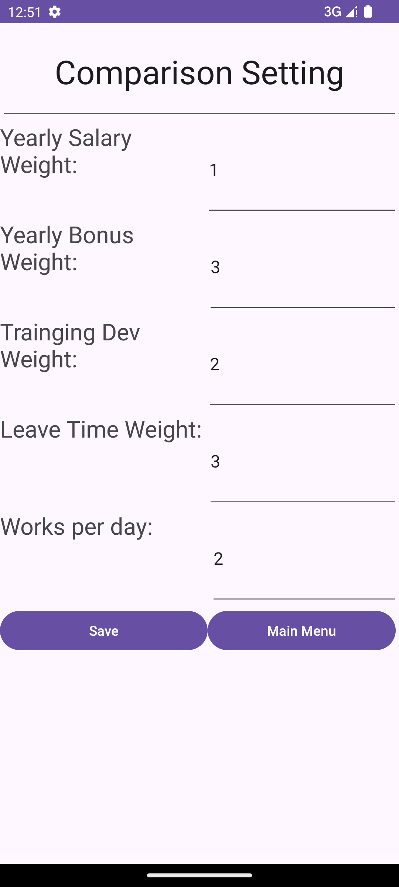

# Design Document

*This is the template for your design document. The parts in italics are concise explanations of what should go in the corresponding sections and should not appear in the final document.*

**Author**: Team 094

## 1 Design Considerations

*The subsections below describe the issues that need to be addressed or resolved prior to or while completing the design, as well as issues that may influence the design process.*

### 1.1 Assumptions

*The application allowed users to enter job details and comapre between jobs. Also, the app is designed for single user which only run rhe app locally.*

### 1.2 Constraints

*There is not database for the app, all information should be stored locally.*

### 1.3 System Environment

*The application shold be runned with Android 33 which means a phone or device with Android 33 is needed. To build the app, the creater needs to use Gradle version 8.2 and Java 17.*

## 2 Architectural Design

*The architecture provides the high-level design view of a system and provides a basis for more detailed design work. These subsections describe the top-level components of the system you are building and their relationships.*

### 2.1 Component Diagram

*Since our application is supposed to run locally for one user, the application does not need many componets like safety check. Thus, for our simple system, the component diagram is not necessary.*

### 2.2 Deployment Diagram

*Since our software system is simple which does not have many components, the deployment diagram is not necessary.*

## 3 Low-Level Design

*Describe the low-level design for each of the system components identified in the previous section. For each component, you should provide details in the following UML diagrams to show its internal structure.*

### 3.1 Class Diagram

### 3.2 Other Diagrams

*<u>Optionally</u>, you can decide to describe some dynamic aspects of your system using one or more behavioral diagrams, such as sequence and state diagrams.*

## 4 User Interface Design

