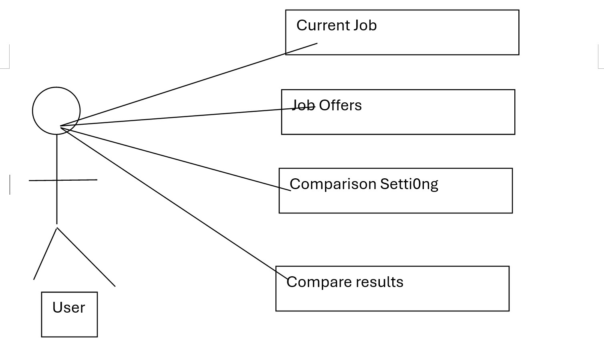

# Use Case Model

*This is the template for your use case model. The parts in italics are concise explanations of what should go in the corresponding sections and should not appear in the final document.*

**Author**: Team 094

## 1 Use Case Diagram

## 2 Use Case Descriptions

Current Job:

Requirements:
The user can enter the information like company and title of the current job. After that user can save information and exist to main menu.

Pre-conditions:
The current job button is clicked by the user.

Post-conditions Conditions:
All required information are entered by the user.

Scenarios: 
No all information given: raise the error message will gives user a hint.
Save: save the information.
Exist: go back to the main menu.

Job Offers:

Requirements:
The user can enter the information like company and title of the  job offer. The user can continue to enter job offers. After that user can save information and exist to main menu.

Pre-conditions:
The job offer button is clicked by the user.

Post-conditions Conditions:
All required information are entered by the user.

Scenarios: 
No all information given: raise the error message will gives user a hint.
Save: save the information.
Exist: go back to the main menu.
Continue: a new page with empty imputs will show for user to enter

Comparison Setting:

Requirements:
The user can enter the index for variable to compute in comparison seeting.

Pre-conditions:
The Comparison setting button is clicked by the user.

Post-conditions Conditions:
None.

Scenarios: 
No all information given: If the user does not set index, all index will be equal and set to 1.
Save: save the information.
Exist: go back to the main menu.

Comparison Result:

Requirements:
The user can see the compare results.

Pre-conditions:
The Comparison result button is clicked by the user.

Post-conditions Conditions:
None.

Scenarios: 
No jobs to compare:There will be a message to remind the user not entering job offers yet.
Success: A table with Company name, title and score will be shown to the user. The order is sorted by score.

